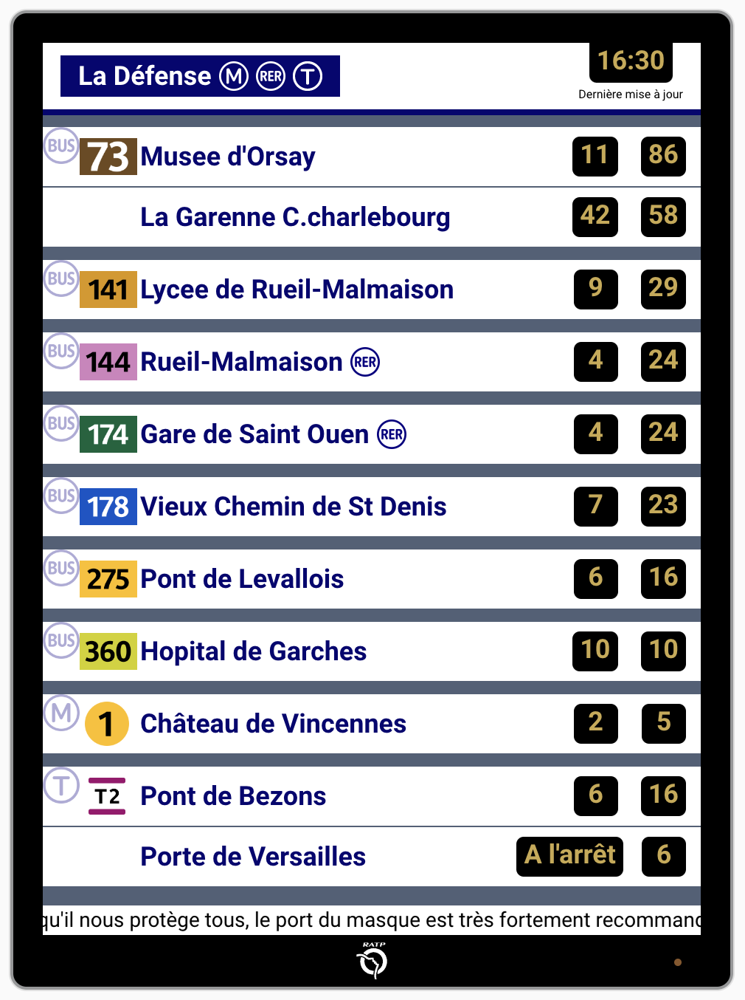
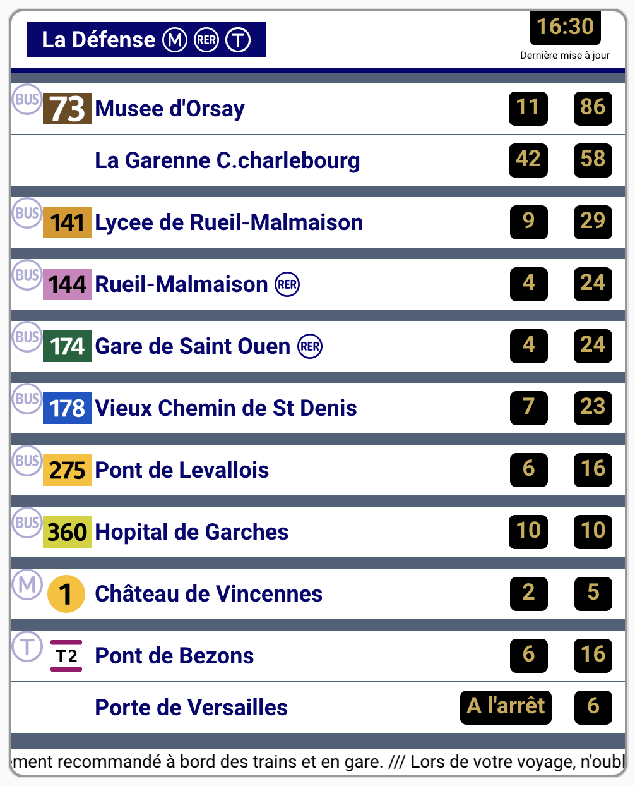
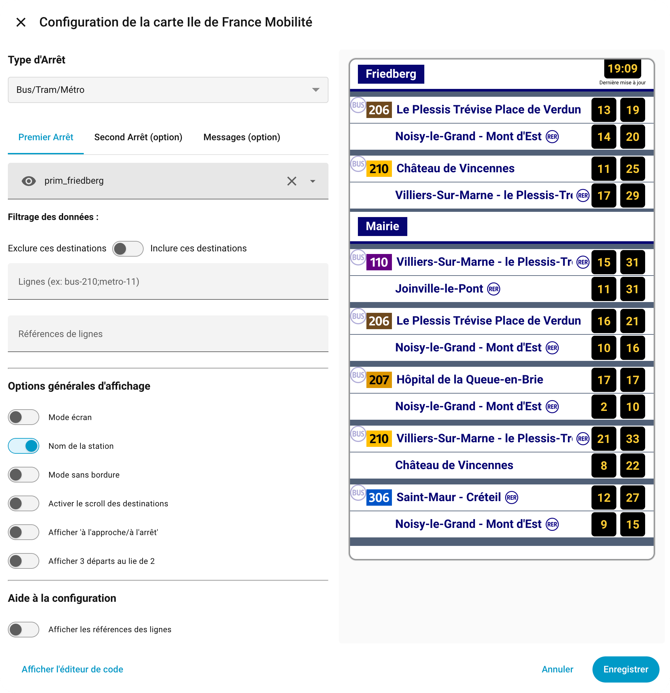
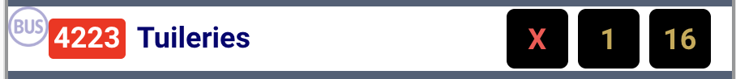

# Carte Lovelace : Île‑de‑France Mobilité

[](https://github.com/hacs/integration)
[](https://github.com/bontiv/lovelace-idf-mobilite/releases)
[](https://github.com/bontiv/lovelace-idf-mobilite/commits/main)
[](https://github.com/bontiv/lovelace-idf-mobilite/issues)
[](https://github.com/bontiv/lovelace-idf-mobilite/stargazers)
[](https://github.com/bontiv/lovelace-idf-mobilite/blob/main/LICENSE)

[](https://github.com/yyrkoon94/idf-mobilite-assistant)
[](https://prim.iledefrance-mobilites.fr/)
[](https://www.iledefrance.fr/)

---

Ce dépôt reprend une grande partie du travail de [yyrkoon94](https://github.com/yyrkoon94/lovelace-idf-mobilite), mais avec un bon nettoyage, un petit coup de bundle, une meilleure compatibilité avec les dernières version de Home Assistant (testé avec la version 2026).

## Présentation

Cette carte Lovelace affiche les prochains passages des transports du réseau **Île‑de‑France Mobilités** :

- Bus
- Tram
- Métro
- RER
- SNCF

Elle utilise l'API **PRIM** (*Plateforme Régionale d'Information pour la Mobilité*).

> ⚠️ **Quota PRIM** : les comptes créés depuis mars 2024 disposent de 1000 appels/jour.
> Ajustez la fréquence de rafraîchissement ou demandez une augmentation de quota.

---

## Captures d'écran
<p align="center">
  
  
</p>

<p align="center">
   
</p>

---

## 1. Installer l'intégration

Ajoutez l'intégration par HACS :

[](https://my.home-assistant.io/redirect/hacs_repository/?owner=yyrkoon94&repository=idf-mobilite-assistant&category=integration)

→ Paramètres → Appareils & Services → Ajouter une intégration → **IDF Mobilité Assistant**

## 2. Ajouter vos arrêts
L'intégration vous permet :

- de rechercher un arrêt
- de rechercher une ligne pour les messages de perturbation
- de créer automatiquement les entités nécessaires

## 3. Installation de la carte

[](https://my.home-assistant.io/redirect/hacs_repository/?owner=bontiv&repository=lovelace-idf-mobilite&category=plugin)

Installation par HACS.


## 4. Ajouter la carte Lovelace
Dans votre tableau de bord :

- Ajouter une carte
- Choisir **Carte IDF Mobilité**
- Sélectionner les entités créées par l'intégration

---

## 5. Configuration de la carte

La carte dispose d'un éditeur graphique complet dans Home Assistant.

<p align="center">
   
</p>

---

### 🟦 1. Type d'arrêt

Choisissez le type de ligne :

- **RER / SNCF**
- **Bus / Tram / Métro**

Certaines options dépendent de ce choix.

---

### 🟩 2. Premier arrêt

Sélectionnez l'entité contenant les données **Siri**.

#### Filtrage des lignes

- **Lignes à exclure**
  Exemple : `bus-210;metro-11`

- **Références de lignes à exclure**
  Pour filtrer des branches spécifiques.

#### Options BUS
- Inclure uniquement certaines destinations
- Ou exclure certaines destinations
- Switch pour inverser le comportement

#### Options RER / SNCF
- Nombre de départs à afficher
- Délai maximum (minutes)
- Afficher l'heure au lieu du délai
  - Option : conserver le délai pour X départs
- Afficher le quai
- Grouper les destinations
  - Libellé personnalisé possible

---

### 🟧 3. Second arrêt (optionnel)

Permet d'afficher une seconde ligne dans la même carte.

Options identiques au premier arrêt.

---

### 🟥 4. Messages (optionnel)

La carte peut afficher les messages d'information et de perturbation.

#### Sélection des entités
Vous pouvez sélectionner **une ou plusieurs entités** contenant `disruptions`.

#### Options
- Filtrer les messages par texte
- Afficher les perturbations
- Afficher les alertes
- Afficher les messages d'information
- Mode statique (pas de défilement)

---

### 🟦 5. Options générales d'affichage

- Mode écran (style panneau TV)
- Afficher le nom de la station
- Mode sans bordure
- Faire scroller les destination si elle
- BUS : afficher "à l'approche / à l'arrêt"
- BUS : afficher 3 départs
- RER : afficher les bus de remplacement
- Gestion des transports supprimés ou retardés


---

### 🟪 6. Aide à la configuration

- Afficher les références des lignes
  → utile pour configurer les filtres avancés

---

## Référence des paramètres de configuration YAML

Voici la liste complète de tous les paramètres disponibles dans la configuration YAML de la carte.

### Paramètres généraux

| Paramètre | Type | Défaut | Description |
|-----------|------|--------|-------------|
| `type` | `string` | — | **Obligatoire.** Doit toujours valoir `custom:idf-mobilite-card`. |
| `lineType` | `string` | `RER` | Type de transport affiché. Valeurs possibles : `RER` (RER / SNCF) ou `BUS` (Bus / Tram / Métro). |
| `show_screen` | `boolean` | `false` | Active le mode « panneau TV » (fond sombre, logo RATP, style affichage gare). |
| `wall_panel` | `boolean` | `false` | Mode sans bordure / fond transparent, adapté à un affichage mural. |
| `show_station_name` | `boolean` | `true` | Affiche ou masque le nom de la station en en-tête de la carte. |
| `destination_scroll` | `boolean` | `false` | Active le défilement horizontal (ping-pong) des noms de destination trop longs. |

---

### Premier arrêt (entité principale)

| Paramètre | Type | Défaut | Description |
|-----------|------|--------|-------------|
| `entity` | `string` | — | **Obligatoire.** Identifiant de l'entité Home Assistant contenant les données Siri (ex : `sensor.prim_la_defense`). |
| `exclude_lines` | `string` | — | Liste de lignes à exclure, séparées par des points-virgules (ex : `bus-210;metro-11`). |
| `exclude_lines_ref` | `list` | — | Liste de références de lignes à exclure (branches spécifiques). Tableau de chaînes. |

#### Options Bus / Tram / Métro (premier arrêt)

| Paramètre | Type | Défaut | Description |
|-----------|------|--------|-------------|
| `included_destination` | `string` | — | Destinations à inclure ou exclure (selon `show_only_included`). Séparées par des points-virgules. |
| `show_only_included` | `boolean` | `false` | Si `false`, les destinations de `included_destination` sont **exclues**. Si `true`, seules ces destinations sont **incluses**. |

#### Options RER / SNCF (premier arrêt)

| Paramètre | Type | Défaut | Description |
|-----------|------|--------|-------------|
| `nb_departure_first_line` | `number` | — | Nombre de départs à afficher. Si omis, tous les départs disponibles sont affichés. |
| `max_delay_first_line` | `number` | `60` | Délai maximum en minutes au-delà duquel les départs ne sont plus affichés. |
| `show_hour_departure_first_line` | `boolean` | `false` | Affiche l'heure de départ (ex : `14:32`) au lieu du délai en minutes. |
| `show_hour_departure_index_first_line` | `number` | — | Index à partir duquel l'heure est affichée à la place du délai (les départs avant cet index restent en minutes). Nécessite `show_hour_departure_first_line: true`. |
| `show_departure_platform_first_line` | `boolean` | `false` | Affiche le numéro de quai de départ. |
| `group_destination_first_line` | `boolean` | `false` | Regroupe les départs par destination. |
| `group_destination_name_first_line` | `string` | — | Filtre l'affichage sur une destination précise (libellé exact). Nécessite `group_destination_first_line: true`. |

---

### Second arrêt (optionnel)

| Paramètre | Type | Défaut | Description |
|-----------|------|--------|-------------|
| `second_entity` | `string` | — | Identifiant d'une seconde entité Home Assistant à afficher dans la même carte. |
| `exclude_second_lines` | `string` | — | Lignes à exclure pour le second arrêt. Même syntaxe que `exclude_lines`. |
| `exclude_second_lines_ref` | `list` | — | Références de lignes à exclure pour le second arrêt. Tableau de chaînes. |

#### Options Bus / Tram / Métro (second arrêt)

| Paramètre | Type | Défaut | Description |
|-----------|------|--------|-------------|
| `included_second_lines_destination` | `string` | — | Destinations à inclure ou exclure pour le second arrêt. |
| `show_only_included_second_lines` | `boolean` | `false` | Même comportement que `show_only_included`, appliqué au second arrêt. |

#### Options RER / SNCF (second arrêt)

| Paramètre | Type | Défaut | Description |
|-----------|------|--------|-------------|
| `nb_departure_second_line` | `number` | — | Nombre de départs à afficher pour le second arrêt. |
| `max_delay_second_line` | `number` | `60` | Délai maximum en minutes pour le second arrêt. |
| `show_hour_departure_second_line` | `boolean` | `false` | Affiche l'heure de départ pour le second arrêt. |
| `show_hour_departure_index_second_line` | `number` | — | Index de basculement heure/minutes pour le second arrêt. |
| `show_departure_platform_second_line` | `boolean` | `false` | Affiche le numéro de quai pour le second arrêt. |
| `group_destination_second_line` | `boolean` | `false` | Regroupe les départs par destination pour le second arrêt. |
| `group_destination_name_second_line` | `string` | — | Filtre sur une destination précise pour le second arrêt. |

---

### Messages et perturbations

| Paramètre | Type | Défaut | Description |
|-----------|------|--------|-------------|
| `messages` | `string` ou `list` | — | Entité ou liste d'entités Home Assistant contenant les données de perturbations (`disruptions`). |
| `filter_messages` | `string` | — | Texte de filtrage : seuls les messages contenant cette chaîne sont affichés. |
| `display_info_message` | `boolean` | `false` | Affiche les messages d'information réseau. |
| `display_delays_message` | `boolean` | `false` | Affiche les messages de perturbation (retards significatifs, `SIGNIFICANT_DELAYS`). |
| `display_no_service_message` | `boolean` | `false` | Affiche les alertes de suppression de service (`NO_SERVICE`). |
| `no_messages_scroll` | `boolean` | `false` | Désactive le défilement horizontal des messages (affichage statique). |

---

### Options spécifiques Bus

| Paramètre | Type | Défaut | Description |
|-----------|------|--------|-------------|
| `show_bus_stop_label` | `boolean` | `false` | Affiche des libellés textuels à la place des chiffres pour les états spéciaux : « À l'approche », « À quai », « Supprimé », « Retardé ». |
| `display_third_stop` | `boolean` | `false` | Affiche un troisième départ par destination (2 par défaut). |

---

### Options spécifiques RER / SNCF

| Paramètre | Type | Défaut | Description |
|-----------|------|--------|-------------|
| `show_replacement_bus` | `boolean` | `false` | Affiche les bus de remplacement dans les résultats RER / SNCF. |

---

### Aide à la configuration

| Paramètre | Type | Défaut | Description |
|-----------|------|--------|-------------|
| `show_train_ref` | `boolean` | `false` | Affiche la référence technique des lignes/trains, utile pour configurer les filtres `exclude_lines_ref`. |

---

### Exemple complet

```yaml
type: custom:idf-mobilite-card
lineType: RER
entity: sensor.prim_la_defense
exclude_lines: ""
nb_departure_first_line: 5
max_delay_first_line: 90
show_hour_departure_first_line: true
show_hour_departure_index_first_line: 2
show_departure_platform_first_line: true
group_destination_first_line: false
second_entity: sensor.prim_saint_lazare
nb_departure_second_line: 3
show_replacement_bus: true
messages:
  - sensor.prim_messages_ligne_a
display_delays_message: true
display_no_service_message: true
no_messages_scroll: false
show_station_name: true
show_screen: false
wall_panel: false
destination_scroll: true
```


## Crédits

Carte inspirée du travail de [Lesensei](https://github.com/lesensei) sur [idfm-card](https://github.com/lesensei/idfm-card) et de [yyrkoon94](https://github.com/yyrkoon94/lovelace-idf-mobilite).
